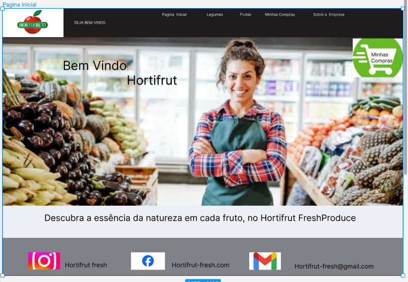
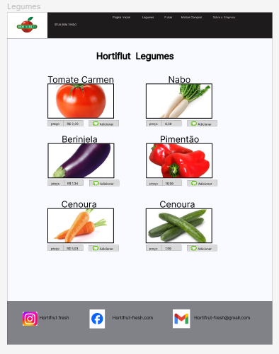
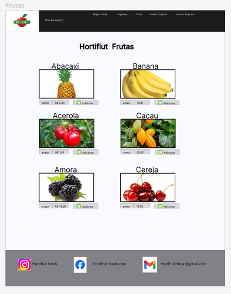
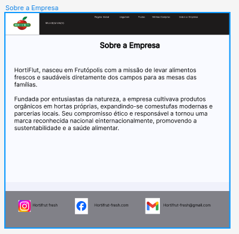
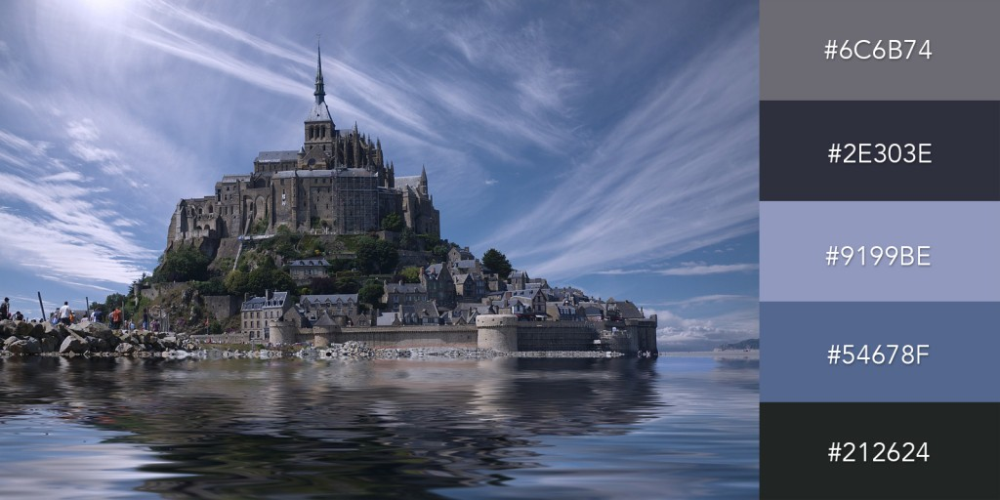

Layout do Figma = https://www.figma.com/file/XiE71jj1I8TBHXMUH0Tvzi/Projeto-Figma-Desenvolvedor?type=design&node-id=0-1&mode=design&t=bBqc94orzoAJjYdz-0

Paleta de Cores

As fontes das imagens que utilizei eu pesquisei na internet as imangens de cada alimento e os seus preços
